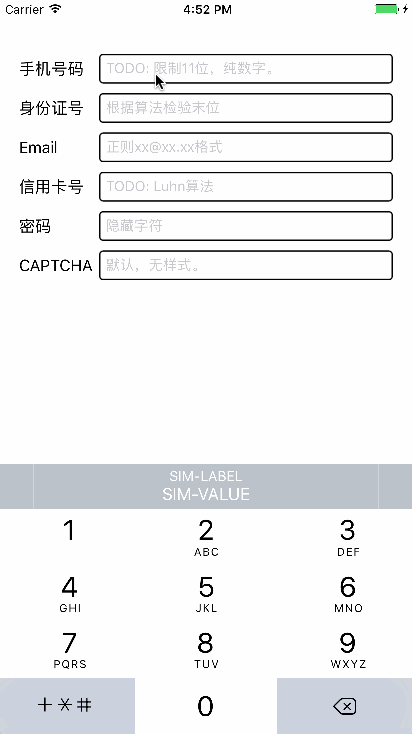

# XCTextField

A general UITextField category for input checking.

Whatever in which way your textField was created, just add the following methods:

For configuration: `- configurationWithType:`

For check: `- inputCheckForceCorrect:`

## Usage:

1. Download zip or clone the repo.
2. Drag the folder `XCTextField` into your project.
3. `#import "UITextField+XCTextField.h"`
4. Have fun.

## Sample GIF:



## Sample Code:

```objc
/**
  some button action such as commit / login / register etc.
 */
- (void)checkButtonAction:(UIButton *)button {
    for (UIView *subview in self.view.subviews) {
        if ([subview isKindOfClass:[UITextField class]]) {
            [(UITextField *)subview inputCheckForceCorrect:YES];
        }
    }
}
```

> `- (void)inputCheckForceCorrect:`
> param: `flag` if `YES` the first incorrect textField became first responder.

## Paraphrase:

- `XCTextFieldTypeDefault`: Style None.
- `XCTextFieldTypeCellphone`: PRC mainland Cellphone number style. `UIKeyboardTypePhonePad`.
- `XCTextFieldTypeEmail`: Email format should be "xxx@xxx.xxx". `UITextContentTypeEmailAddress`.
- `XCTextFieldTypePassword`: Security text. `UIKeyboardTypeASCIICapable`.
- `XCTextFieldTypeCAPTCHA`: //@todo:
- `XCTextFieldTypeCreditCard`: //@todo: Luhn algorithm
- `XCTextFieldTypeIDCard`: 18 digital PRC resident ID card number verify. The last character was calculated base on "ISO 7064:1983.MOD 11-2" algorithm.

